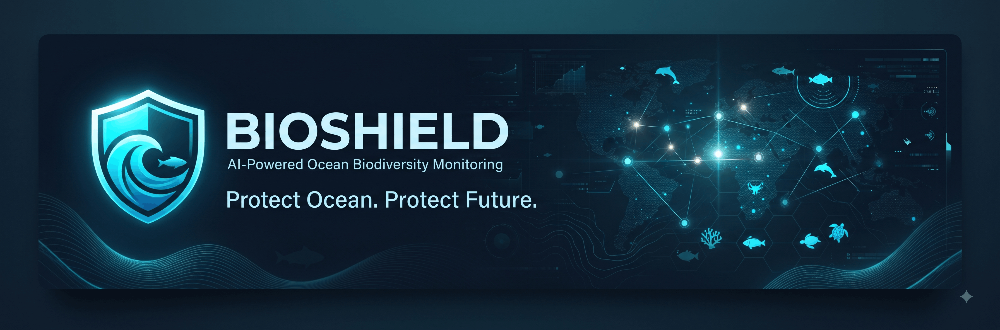
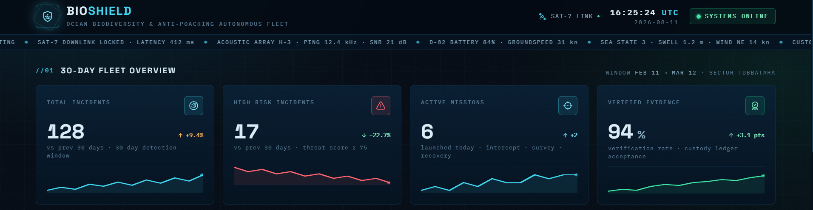
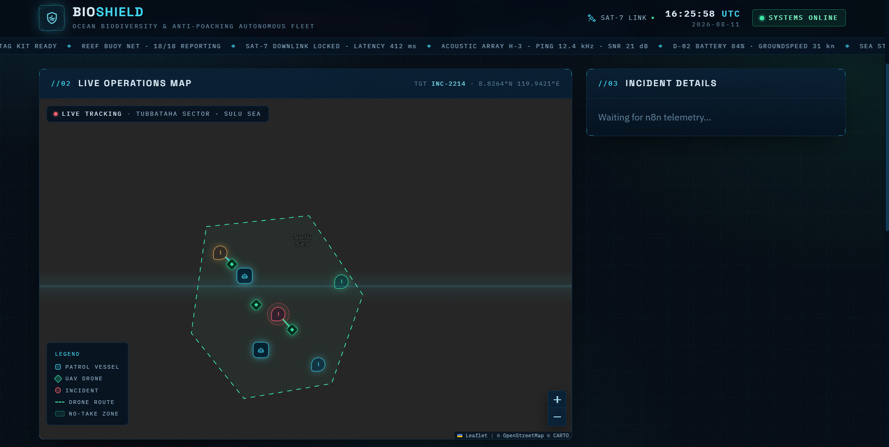
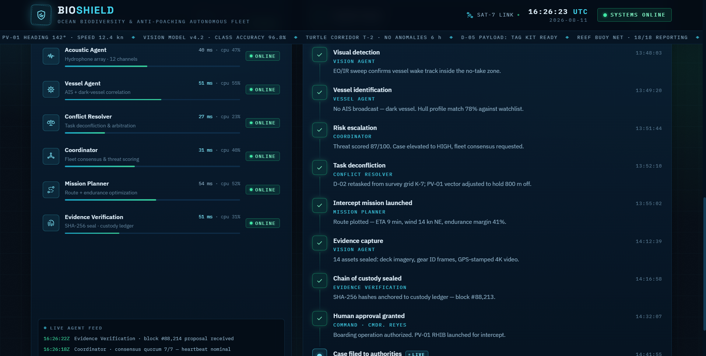

<p align="center">
  
</p>


### AI-Powered Ocean Biodiversity Monitoring & Anti-Poaching System


# 🛡️ BioShield

### AI-Powered Ocean Biodiversity Monitoring & Anti-Poaching System

BioShield is a web-based monitoring platform designed to support **ocean biodiversity protection and anti-poaching efforts** through an interactive interface, geospatial visualization, and AI-assisted monitoring concepts.

<p align="center">
  <a href="https://bioshield-two.vercel.app/">
    
  </a>
</p>

---

## 🌊 Overview

Marine ecosystems face threats from illegal activities, environmental changes, and insufficient real-time monitoring.

BioShield explores how modern web technologies and intelligent monitoring systems can be combined into a single interface for visualizing and understanding potential threats to marine biodiversity.

The project was developed as a rapid prototype focused on demonstrating the concept of an **AI-assisted ocean monitoring system**.

---

## ✨ Features

* 🗺️ Interactive geospatial visualization
* 🌊 Ocean biodiversity monitoring interface
* 🚨 Anti-poaching monitoring concepts
* 📍 Location-based visualization
* 📊 Data-driven monitoring interface
* 🤖 AI-assisted monitoring concept
* 📱 Responsive web interface
* ⚡ Fast Vite-powered development environment

---

## 🧠 Project Concept

```text
                    BIO SHIELD
                        │
                        ▼
              🌊 Ocean Monitoring
                        │
             ┌──────────┴──────────┐
             ▼                     ▼
       📍 Location Data       🌊 Marine Data
             │                     │
             └──────────┬──────────┘
                        ▼
                 🧠 AI Analysis
                        │
                        ▼
                 🚨 Threat Detection
                        │
                        ▼
                  📊 Dashboard
                        │
                        ▼
                  👮 Response
```

---

## 🛠️ Tech Stack

### Frontend

* React
* TypeScript
* Vite
* Tailwind CSS

### Mapping & Geospatial

* Leaflet
* React Leaflet

### Development

* Node.js
* npm
* Git
* GitHub
* Vercel

---

## 📁 Project Structure

```text
Bioshield/
│
├── src/
│   ├── components/
│   ├── data/
│   ├── utils/
│   ├── App.tsx
│   ├── hooks.ts
│   ├── index.css
│   └── main.tsx
│
├── index.html
├── package.json
├── tsconfig.json
├── vite.config.ts
└── README.md
```

---

## 🚀 Getting Started

### 1. Clone the repository

```bash
git clone https://github.com/poovaragansiva-collab/Bioshield.git
```

### 2. Navigate into the project

```bash
cd Bioshield
```

### 3. Install dependencies

```bash
npm install
```

### 4. Start the development server

```bash
npm run dev
```

The application will be available at the local development URL provided by Vite.

---

## 🏗️ Build for Production

```bash
npm run build
```

To preview the production build:

```bash
npm run preview
```

---

## 🌐 Live Demo

🚀 **[Open BioShield](https://bioshield-two.vercel.app/)**

---

## 🎯 Future Improvements

The project can be extended with:

* 🤖 Real-time AI threat analysis
* 📡 Live marine data integration
* 🚨 Automated threat alerts
* 🛰️ Satellite/environmental data integration
* 📊 Historical threat analytics
* 👮 Incident tracking
* 🔐 Authentication and role-based access
* ☁️ Cloud database integration
* ⚙️ Automated workflows

---

## 💡 What I Learned

Building BioShield helped me explore:

* Building interactive React interfaces
* Working with TypeScript
* Integrating geospatial maps
* Structuring a Vite application
* Designing monitoring dashboards
* Deploying a web application
* Translating a real-world environmental problem into a software prototype

---

## 👨‍💻 Author

### Poovaragan S

CSE Student • AI & Full-Stack Developer

🔗 **GitHub:** https://github.com/poovaragansiva-collab

🔗 **LinkedIn:** https://www.linkedin.com/in/poovaragans

---

<div align="center">

## 📸 Screenshots

### 🖥️ Dashboard

<p align="center">
  
</p>

### 🗺️ Monitoring Map

<p align="center">
  
</p>

### 🚨 Threat Monitoring

<p align="center">
  
</p>

### 🌊 Protect the Ocean. Protect the Future.

⭐ If you find this project interesting, consider giving it a star!

---

## 📫 Connect

**GitHub**
https://github.com/poovaragansiva-collab

**LinkedIn**
https://www.linkedin.com/in/poovaragans

**Portfolio**
https://poovaragan-portfolio.vercel.app/

---

</div>
